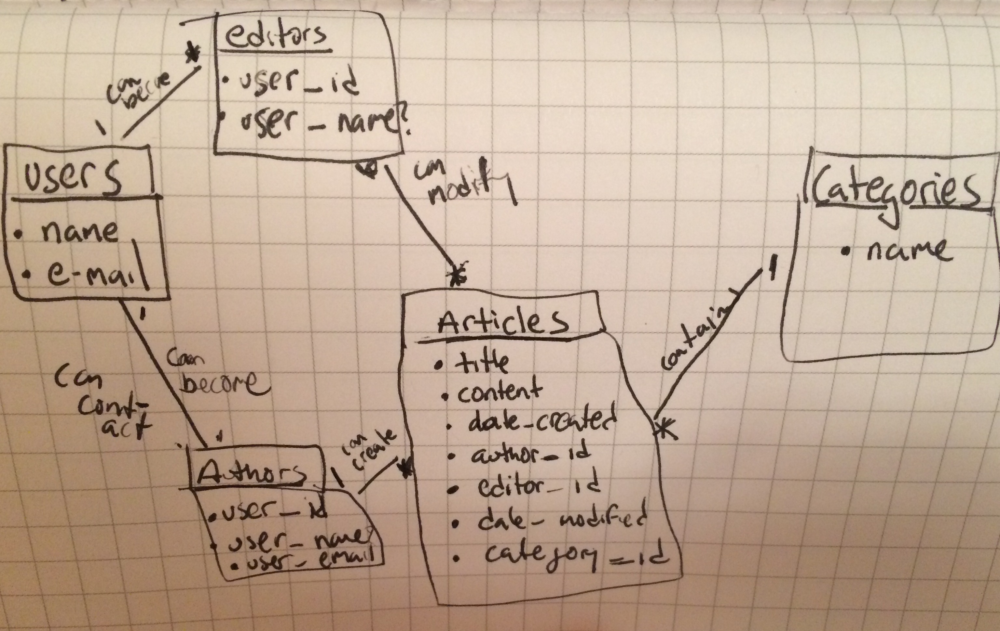

# wiki Project 2
## WDI- Persephone

##User Stories
-

##Technologies Used

-HTML
-CSS
-Ruby & Sinatra
-SQL/Active Revord
-JavaScript/JQuery 

##Front-End Wire Frame

##ERD/Data Model

##Link to Page

Click [here](http://johnnypacia.github.io/Wiki/) To go to Wiki!
