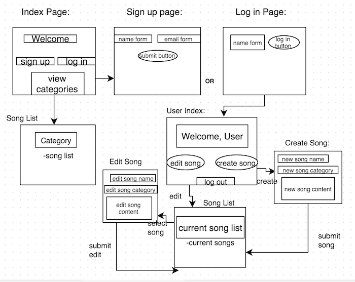
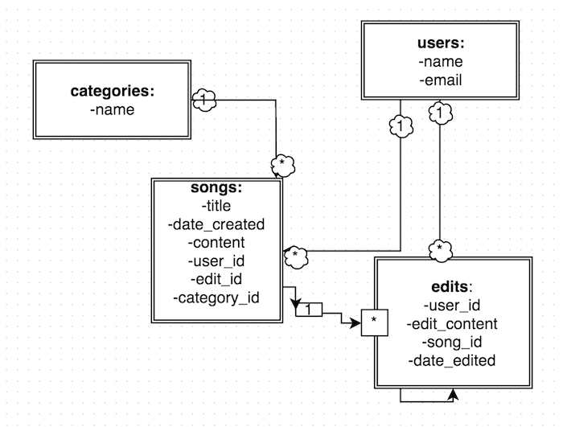

# WDI- Persephone: Project 2

## Henrietta's Country & Hip-Hop Cover Band Wiki!

##Description:
Welcome to the wiki for Henrietta's Country & Hip-Hop band! Henrietta wants all her band mates to keep track of current versions of their set. Incidentally, she is also looking for new band members. So feel free to sign up and join the band! If you do, you'll be able to make changes to the current versions of our songs. And when the muse strikes you, you'll be able to create a song of your own and add it to our set-list! 

##User Stories:

- Visitor to homepage is able to sign up or log in, otherwise user can select a song category to see the songs listed under that category.  
- If user clicks "sign up" they will be prompted to enter their desired username and e-mail into a form to become a user. They will then be redirected to the home page where they can log in 
- Once user is logged they will be able to either create or edit a song by clicking on the appropriate link, or log back out by cilcking on the corresponding button. 
- If a user decides to create a song they will be prompted to enter the song name, genre and lyrics. Once they click the button to create the song it will be added to the database. The user will then be able to see the song they just created in markdown. 
- If user decides to edit they will see a list of links to every song. Clicking on that link will show the current version of the song with a link that will allow them to edit the song.
- If they click the link to edit the song they will see the current version in the text box and can make changes to the title, category and content of the song. 
- Once user submits their edits (by clicking the corresponding button) they will be able to see the current version of the song which should include their edits and the time at which they were submitted. 

##Technologies Used:

- HTML
- CSS
- Ruby & Sinatra
- SQL/Active Revord
- JavaScript/JQuery
- Markdown/redcarpet 

##Front-End Wire Frame:

##ERD:

##Link to Page:

Click [here](https://obscure-refuge-1439.herokuapp.com/) to go to Henrietta's Wiki!
